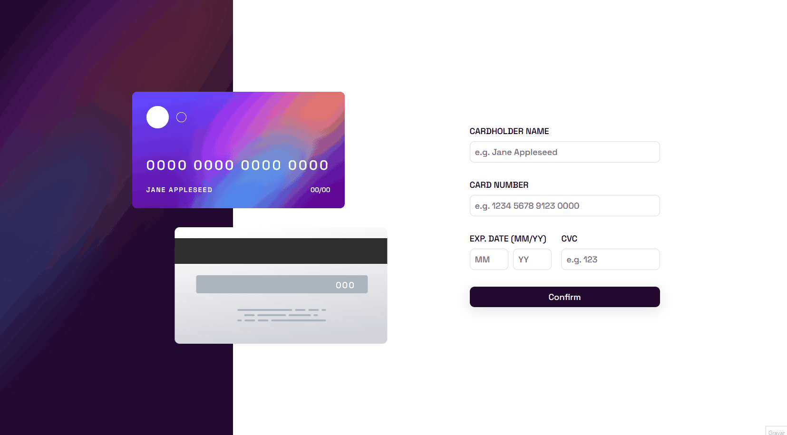
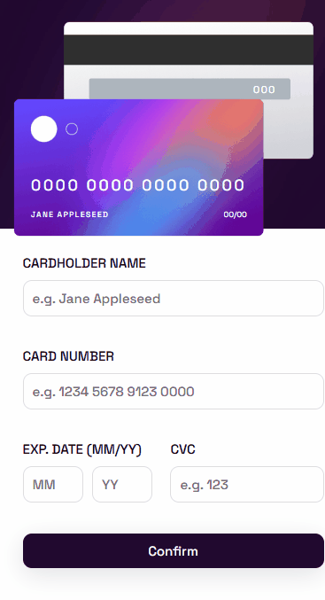

# Frontend Mentor - Interactive card details form solution

This is a solution to the [Interactive card details form challenge on Frontend Mentor](https://www.frontendmentor.io/challenges/interactive-card-details-form-XpS8cKZDWw). Frontend Mentor challenges help you improve your coding skills by building realistic projects. 

## Table of contents

- [Overview](#overview)
  - [The challenge](#the-challenge)
  - [Screenshot](#screenshot)
  - [Links](#links)
- [My process](#my-process)
  - [Built with](#built-with)
  - [What I learned](#what-i-learned)
  - [Continued development](#continued-development)
  - [Useful resources](#useful-resources)
- [Author](#author)
- [Acknowledgments](#acknowledgments)

## Overview

### The challenge

Users should be able to:

- Fill in the form and see the card details update in real-time
- Receive error messages when the form is submitted if:
  - Any input field is empty
  - The card number, expiry date, or CVC fields are in the wrong format
- View the optimal layout depending on their device's screen size
- See hover, active, and focus states for interactive elements on the page

### Screenshot

- Desktop version

- Mobile version

### Links

- Live Site URL: [Live site at GitHub-Pages](https://advice-generator-app-with-react-6tf3633hg-viniciusmontibeller.vercel.app/)

## My process

### Built with

- Javascript
- [React Hook Form](https://react-hook-form.com/) - React library
- [React](https://reactjs.org/) - JS library
- [Styled Components](https://styled-components.com/) - For styles

### What I learned

In this project i was able to learn how to build a react form with diferent inputs and validations, hot to make the inputs interactive and how to mask an input.

### Continued development

With this project i learned how powerful react librarys are, especially React Hook Form and Zod, and want to build more project using different types of librarys.

### Useful resources

- [W3Schools](https://www.w3schools.com/)
- [MDN Web Docs](https://developer.mozilla.org/en-US/)
- [Dev em Dobro](https://github.com/devemdobro)

## Author

- Github - [viniciusmontibeller](https://github.com/viniciusmontibeller)
- Frontend Mentor - [@viniciusmontibeller](https://www.frontendmentor.io/profile/viniciusmontibeller)

## Acknowledgments

I got to say that i'm really happy to be studying with the lessons by [Dev em Dobro](https://github.com/devemdobro). I started with zero programing skills and now i can see that i'm growing little by little into what i wanted to be.